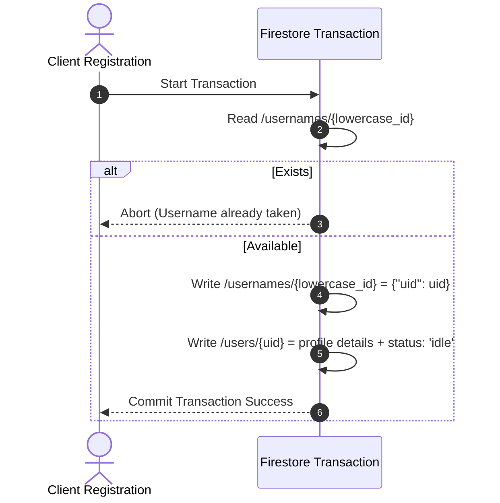
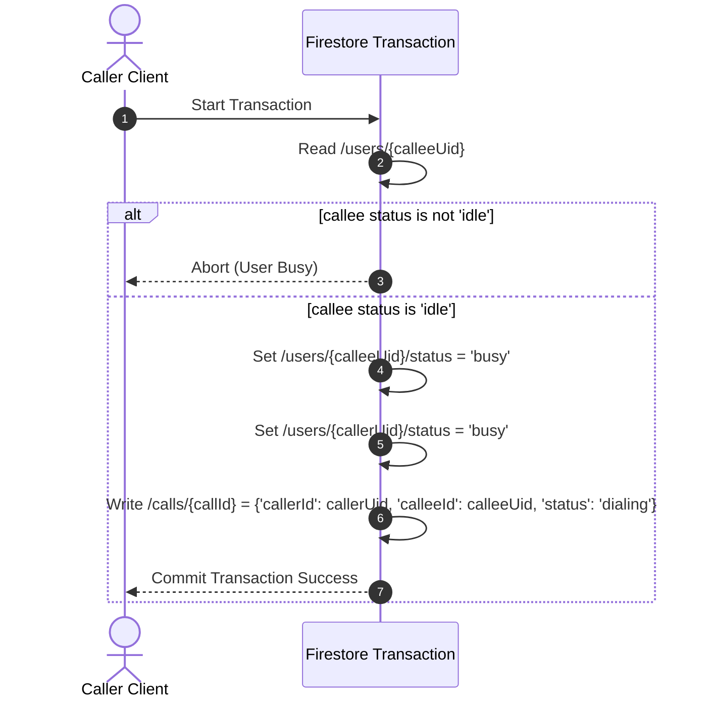

# Final Approved Implementation Plan: Phase 1 Signaling & SignBridge IDs

This plan implements username registration uniqueness locks and direct calling mechanisms via atomic transactions in Firestore.

---

## 1. Updated Firestore Schema

### `/usernames/{lowercase_id}` (Document)
- **ID:** Lowercase SignBridge ID (e.g. `kelvin`).
- **Data:**
  ```json
  {
    "uid": "firebase_auth_user_uid"
  }
  ```

### `/users/{uid}` (Document)
- **ID:** Firebase Auth UID.
- **Data:**
  ```json
  {
    "uid": "firebase_auth_user_uid",
    "displayName": "Kelvin Mbise",
    "signBridgeId": "kelvin",
    "status": "idle",
    "createdAt": "serverTimestamp"
  }
  ```

### `/calls/{callId}` (Document)
- **ID:** Auto-generated Firestore ID.
- **Data:**
  ```json
  {
    "callerId": "caller_uid",
    "calleeId": "callee_uid",
    "status": "dialing",
    "offer": {
      "sdp": "...",
      "type": "offer"
    },
    "answer": {
      "sdp": "...",
      "type": "answer"
    },
    "timestamp": "serverTimestamp"
  }
  ```
- **Sub-collections:**
  - `/calls/{callId}/callerCandidates` (ICE Candidates)
  - `/calls/{callId}/calleeCandidates` (ICE Candidates)

---

## 2. Transaction Flowcharts

### A. Registration Uniqueness Transaction


### B. Call Dialing Lock Transaction


---

## 3. Scope of File Modifications

### Modifications:
* **`lib/services/firebase/firestore_service.dart`**: Adds accessor helper functions for usernames and call logs.
* **`lib/services/auth/auth_service.dart`**: Implements the registration transaction.
* **`lib/ui/screens/login_screen.dart`**: Inputs username fields and sanitization patterns.
* **`lib/services/webrtc/signaling_service.dart`**: Accepts dynamic `callId` configurations.
* **`lib/controllers/call_controller.dart`**: Manages dials and dispatches.

### New Service:
* **`lib/services/webrtc/call_manager.dart`**: Orchestrates dialing locks, timers, and active status updates.
