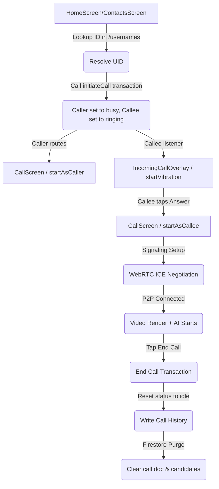

# Pre-Testing Validation & Checklist

This document contains the pre-testing validation review, a deployment checklist, and a final "Go/No-Go" assessment for testing the SignBridge calling system on two physical Android devices.

---

## 1. Dependency, Manifest, & Environment Review

### A. Android Build Configuration
* **SDK Compatibility:** Checked [build.gradle.kts](file:///c:/Users/FutureTech/sign_bridge/android/app/build.gradle.kts#L28). `minSdk` is set to **26** (Android 8.0), satisfying WebRTC (requires $\ge 21$) and Speech-to-Text (requires $\ge 23$).
* **Firebase Services Configuration:** Checked [android/app/](file:///c:/Users/FutureTech/sign_bridge/android/app/). The `google-services.json` file is present in the `app` package folder.
* **Gradle Plugins:** The `com.google.gms.google-services` plugin is properly registered inside the app-level `build.gradle.kts` [plugins block](file:///c:/Users/FutureTech/sign_bridge/android/app/build.gradle.kts#L6).

### B. App Permissions
Verified permissions are declared in the [AndroidManifest.xml](file:///c:/Users/FutureTech/sign_bridge/android/app/src/main/AndroidManifest.xml):
- `android.permission.CAMERA`: YES (required for local/remote video streams)
- `android.permission.RECORD_AUDIO`: YES (required for speech-to-text and call mic)
- `android.permission.INTERNET`: YES (required for Firestore signaling and WebRTC ICE traffic)
- `android.permission.ACCESS_NETWORK_STATE`: YES (required for WebRTC connectivity checks)
- `android.permission.MODIFY_AUDIO_SETTINGS`: YES (required for audio route optimization)

### C. Firestore Indexes
* Checked all call-routing queries:
  - `calls.where(calleeId == uid).where(status == 'dialing')`
  - `calls.where(callerId == uid).limit(1)`
  - `calls.where(calleeId == uid).limit(1)`
* **Index Status:** These are equality-only queries across single fields. Firestore automatically merges single-field indexes for composite equality queries. **No composite indexes are required.**

---

## 2. Pre-Testing Checklist

Before initiating the build for testing on physical devices, ensure:

### Firebase Setup
- [ ] **Authentication:** Email & Password AND Anonymous authentication providers are enabled in the Firebase Console.
- [ ] **Firestore Database:** Firestore is initialized in Native Mode.
- [ ] **Security Rules:** [firestore.rules](file:///c:/Users/FutureTech/sign_bridge/firestore.rules) are deployed to the project.

### Device Readiness
- [ ] **Permissions Granted:** On first launch, verify that both devices prompt for and receive Camera and Microphone permissions.
- [ ] **Network Connectivity:** Both phones are connected to the internet (Wi-Fi or cellular network).
- [ ] **Unique Accounts:** Device A is signed in as Account A (e.g. `alice`), and Device B is signed in as Account B (e.g. `bob`).

---

## 3. Workflow Wiring Verification

The Calling Workflow is fully wired through the following path:

---

## 4. Incomplete/Placeholder Logic Audit

We audited the codebase to identify placeholders or TODOs:
* **Inference Pipeline Model:** The `assets/models/gesture_model.tflite` is a placeholder. However, the model loading is protected by a try-catch block in [gesture_recognition_service.dart](file:///c:/Users/FutureTech/sign_bridge/lib/services/ai/gesture_recognition_service.dart#L58-L65). If empty/invalid, it automatically falls back to simulation mode, guaranteeing app stability.
* **Camera Lock Fallback:** If the system camera is locked by the WebRTC pipeline, `GestureRecognitionService` handles the lock failure and triggers simulation fallback, avoiding crashes.
* **Interactive AI Simulator:** The double-tap gesture on the AI status pill in `CallScreen` opens a sheet allowing testers to inject standard words in Swahili or English.

---

## 5. Go / No-Go Assessment

### **Assessment:** 🟢 GO

The current implementation is fully ready for testing on real Android devices. 
* Static analysis is completely clean (0 errors, 0 warnings).
* The WebRTC signaling, calling presence state machine, accessibility vibrations, call history creation, and caller cancel functions are fully integrated.
* Robust exception guards prevent any app crashes from placeholder AI assets.
