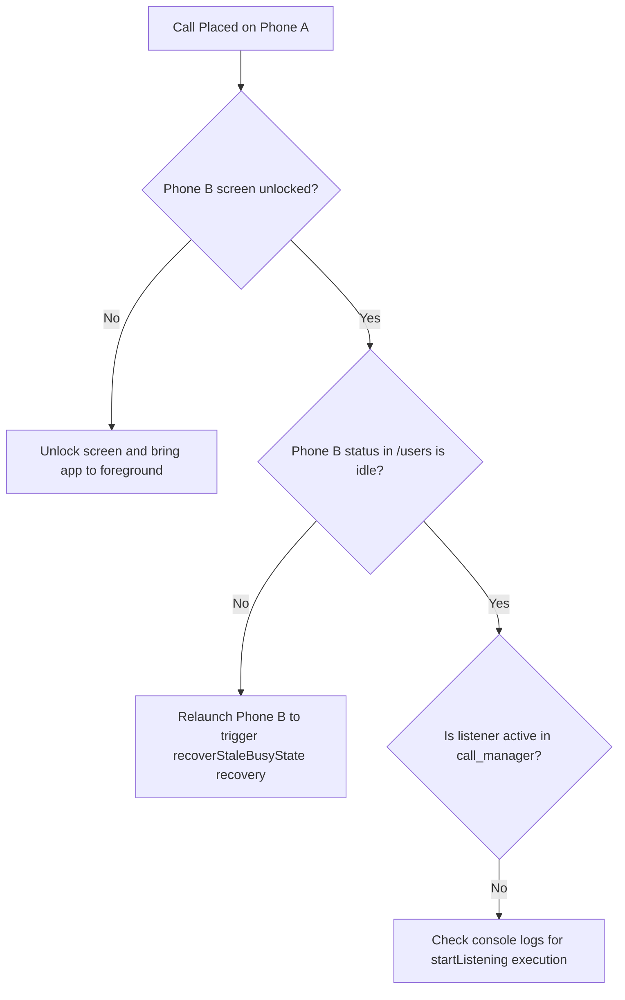
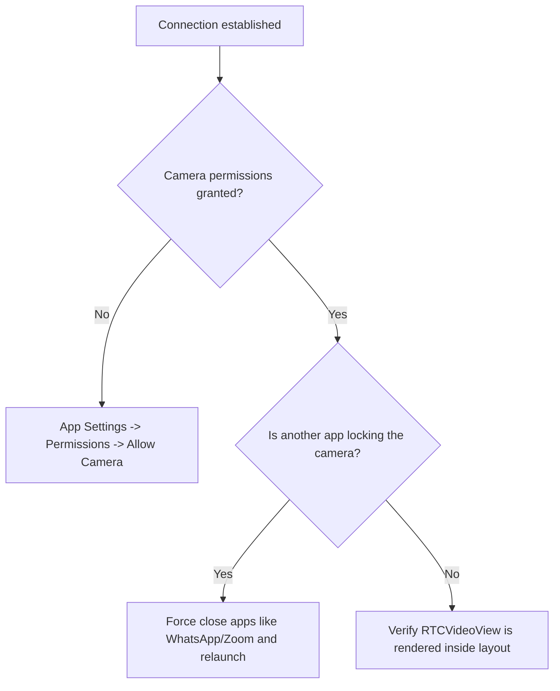

# SignBridge Calling Runtime Debug Checklist

This checklist contains console logging specs, troubleshooting guides, and database verification pointers to support testing on physical Android devices.

---

## 1. Log Reference: Console Logs to Watch (`adb logcat` / IDE console)

When debugging your live builds, look for these signature logs to verify correct state transitions:

### A. Call Initiation (Caller)
* **Creating Call Record:**
  `[CallManager] ...` (from `initiateCall` transaction)
* **SDP Offer Creation:**
  `[Signaling] Received local SDP (offer)`
* **ICE Gathering:**
  `[WebRTC] ICE gathering state → RTCIceGatheringStateGathering`
  `[WebRTC] ICE connection state → RTCIceConnectionStateChecking`

### B. Incoming Call Detection & Acceptance (Callee)
* **Incoming Call Received:**
  `[CallManager] startListening: Document added / Incoming Call ID: {callId}`
* **Vibration Start:**
  `[VibrationService] startIncomingCallVibration()`
* **Accepting Call Transaction:**
  `[CallManager] acceptCall: Setting calls/{callId} status to accepted`
* **Vibration Stop:**
  `[VibrationService] stopVibration()`

### C. WebRTC Signaling Exchange
* **SDP Offer Applied (Callee):**
  `[Signaling] Received offer SDP — applying to peer connection`
* **SDP Answer Sent (Callee):**
  `[Signaling] Received local SDP (answer)`
* **SDP Answer Applied (Caller):**
  `[Signaling] Received answer SDP — applying to peer connection`
* **ICE Exchange:**
  `[WebRTC] Buffering ICE candidate (remote desc not set yet)` (Expected on callee before offer description is set)
  `[WebRTC] Flushing {N} buffered ICE candidates`

### D. P2P Connected (Both)
* **Connection State Transition:**
  `[CallController] WebRTC connection state: RTCPeerConnectionStateConnected`
* **Remote Video Received:**
  `[WebRTC] remote stream added`
* **Translation Setup:**
  `[CallController] P2P confirmed — starting translation pipeline (lang: en)`

### E. Termination & Cleanup (Both)
* **Call Concluded Transaction:**
  `[CallManager] endCall: Setting calls/{callId} status to ended`
* **User Status Reset:**
  `[CallManager] endCall: Setting users status to idle`
* **Firestore Cleanups:**
  `[CallManager] Deleting candidate sub-collections and calls/{callId}`
* **WebRTC Disposed:**
  `[CallController] dispose` / `[WebRTC] local stream stop`

---

## 2. Firebase Console Monitor Locations

Keep these locations open in the Firebase Console during your live run to verify database updates:

* **User Registries (`/users/{uid}`):**
  Check that the user profile document is updated correctly.
  - While dialing: `status: "busy"` for caller, `status: "ringing"` for callee.
  - Connected: `status: "busy"` for both.
  - Idle/Disconnected: `status: "idle"`.
* **Unique Names Index (`/usernames/{username}`):**
  Verify that unique mapping records exist (e.g. key `alice` with value `{ uid: "UID_OF_ALICE" }`).
* **Active Signaling Docs (`/calls/{callId}`):**
  - While ringing: `status: "dialing"`.
  - While connected: `status: "accepted"`.
  - Check `callerCandidates` and `calleeCandidates` sub-collections fill with candidate documents.
  - On call termination: verify the entire `/calls/{callId}` document is deleted (purged from database).
* **Call Log Index (`/users/{uid}/call_history/{historyId}`):**
  Verify that history objects write for both users under their user document. Check that the `callType` value matches (`incoming`, `outgoing`, `missed`, or `declined`).

---

## 3. Troubleshooting Flowchart

### Issue A: Incoming Call Overlay Not Appearing on Callee


### Issue B: Status Stuck on "Connecting..." / No Video
```mermaid
graph TD
    A[Call Screen Opens on both] --> B{OpenRelay TURN server configured?}
    B -- No --> C[Review webrtc_service.dart config]
    B -- Yes --> D{ICE Candidates Exchanging in Console?}
    D -- No --> E[Verify Firestore calls/{callId} document contains offer and answer fields]
    D -- Yes --> F{Are devices on different networks/Wi-Fi?}
    F -- Yes --> G[Firewall blocking UDP. Ensure TURN credentials are correct]
```

### Issue C: Black Video Screen (but audio is playing)


### Issue D: User Status Stuck on "busy" / Cannot Call Again
* **Symptom:** User cannot call anyone because they are marked busy, even though the call is over.
* **Fix:** Close the app completely and relaunch it. The self-healing logic `recoverStaleBusyState()` in `CallManager` will check if there is an active `/calls` document, find none, and automatically update their status back to `idle`.

### Issue E: History Not Saving
* **Symptom:** The history screen doesn't show the call log after completion.
* **Fix:** Verify that the app calls `CallManager.instance.endCall()` or `cancelCall()` before disposing of the `CallController`. Check if the user has internet connection during call hangup (Firestore writes fail offline).
