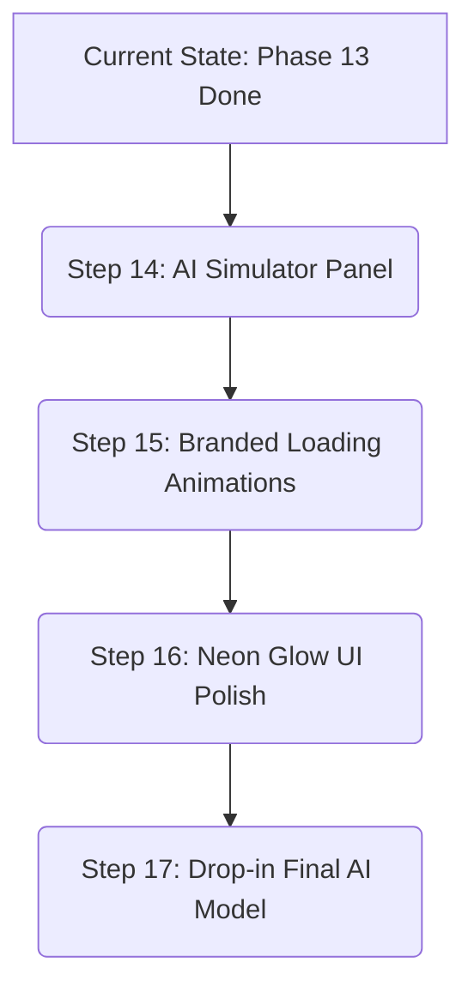

# SignBridge — Master Project Plan & Change Tracking Strategy

**Last Updated:** June 8, 2026

This document serves as the **Single Source of Truth** for the development state, remaining roadmap, and change tracking strategy of the SignBridge project.

---

## 📈 1. Proposed Change Tracking Strategy

To avoid confusion, "rushing," or losing track of progress during future sessions, we will implement a dual-layer tracking strategy:

1. **Active Task List (`task.md`):** Keeps track of individual micro-tasks for the *current active session*. It acts as a temporary checklist and is marked complete before finishing a task.
2. **Master Project Plan Changelog (This File):** At the end of every major phase, this master plan document will be updated to document what was changed, what native updates were made, and how to verify it.

---

## ✅ 2. Current Project Status (What We Have Built)

The app is in a stable, fully functional state. The following phases are complete:

| Phase | Description | Status |
|---|---|---|
| **Phase 1: UI Foundation** | Named routes, light theme, custom spacing tokens (`AppSpacing`, `AppRadius`). | Completed |
| **Phase 2: WebRTC Core** | Video stream renderers and calling permissions setup. | Completed |
| **Phase 3: Firestore Signaling** | SDP offer/answer exchange and ICE candidate syncing. | Completed |
| **Phase 4: Simulated AI** | Simulated gesture interpreter, real Speech-to-Text, and Text-to-Speech plugins. | Completed |
| **Phase 5: Offline DB (Hive)** | Hive databases created for settings, recent calls, and translation histories. | Completed |
| **Phase 6: Orchestration** | `TranslationController` created to route streams to overlays and the WebRTC DataChannel. | Completed |
| **Phase 7: Premium Overlays** | Added Glassmorphic overlays (`GifOverlay`, `CaptionOverlay`) and `AiStatusIndicator`. | Completed |
| **Phase 8: TFLite Plumbing** | Created background Isolate thread to throttle camera streams (3fps) and run interpreters. | Completed |
| **Phase 9: WebRTC Fixes** | Configured STUN/TURN servers, ICE buffering, and Firestore signaling state safeguards. | Completed |
| **Phase 10: Auth Hub** | Redesigned login screen with animated sliding tabs and Google Sign-in. | Completed |
| **Phase 11: Custom Credit** | Tanzanian Sign library links and developer credit lists. | Completed |
| **Phase 12: Bilingual Support** | Real-time English & Kiswahili toggle in Onboarding and Settings, synced with TTS/STT locales. | Completed |
| **Phase 13: Saved Contacts** | Saved Contacts local directory, direct dialing via static User IDs, and Contact Support mail. | Completed |

---

## 🚀 3. Remaining Tasks & Milestone Roadmap

The following 4 steps remain to achieve the final production-ready version of the SignBridge app.

### Step 14: AI Simulator Panel (Testing Helper)
*   **Goal:** Enable comprehensive end-to-end testing of overlays and sync streams before you have your final custom trained AI gesture model.
*   **What to build:** A slide-in drawer on the call screen (triggered by double-tapping the `AiStatusIndicator`). Tapping buttons like `HELLO`, `YES`, `NO`, or `HELP` will manually trigger gesture outputs.
*   **Why it's useful:** You can verify that animations and captions sync across your physical devices in real-time.

### Step 15: Custom Logo Loading Animations
*   **Goal:** Replace default progress circles with a branded, breathing loading animation to elevate the app's premium feel.
*   **What to build:** Build a custom widget that applies a soft, pulsing opacity and scale animation to the SignBridge hand logo.
*   **Where to place it:** On the login screen during authentication, and on the call screen during initial WebRTC signaling.

### Step 16: Neon Glow UI Effects
*   **Goal:** Add modern neon-ambient glows for focused buttons, active badges, and headers to match the neumorphic and glassmorphic aesthetic.
*   **What to build:** Build reusable text and container decorations that apply rich `BoxShadow` and `Shadow` filters using primary brand colors (`AppColors.primary` and `AppColors.accent`).

### Step 17: Final Model & GIF Asset Drop-in (Future Phase)
*   **Goal:** Connect your final trained ASL/Swahili gesture model and assets.
*   **What to build:** No code changes are required. Simply place the final `.tflite` model in `assets/models/`, replace the label definitions in `assets/labels/gesture_labels.txt`, and drop the corresponding GIFs into `assets/gifs/`.

---

## 📅 4. Suggested Execution Schedule

We will implement the remaining tasks in structured blocks to maintain stability and make testing easy:

1. **Next Session Milestone:** Implement **Step 14 (AI Simulator Panel)**. This will give us a fully testable UI.
2. **Polishing Milestone:** Combine **Step 15** and **Step 16** (Logo animations & Neon glows) to complete the premium visual layout.
3. **Delivery Milestone:** Package the project files for deployment. The app is ready to load the real model (Step 17) whenever it is available.
